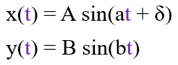
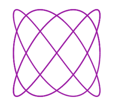
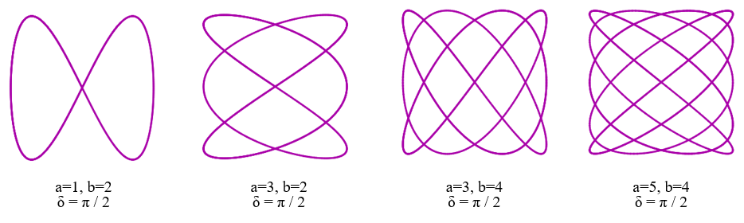
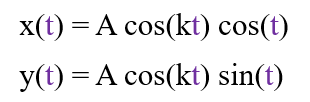
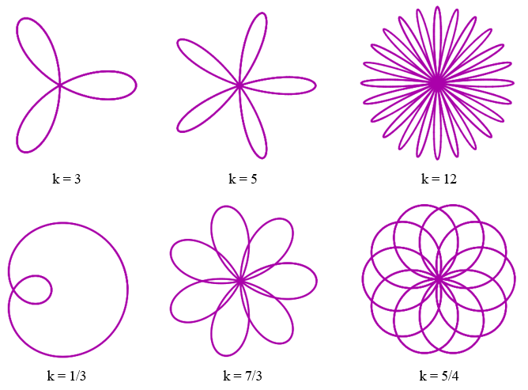

Lissajous curves are a family of curves that have applications in
physics, astronomy and other sciences.

They are defined by an equation which we will be providing you with and
you will be adjusting the values of the inputs 'a' and 'b' in the Python
code in order to make it trace different curves.

**Taken and adapted from:**
[101 Computing .net](https://www.101computing.net/python-turtle-lissajous-curve/)

## 1 - Open trinket and setup your environment

Navigate to: [https://trinket.io](https://trinket.io/)

If you already have a trinket account, login, otherwise create a new one
(you might need an email address for this), this will allow you to save
your code at the end of the session.

Once you have your blank project ready, import the turtle library, which
will allow you to use functions to draw with and import the functions we
will need from the math library, as well:
```python
import turtle
from math import cos, sin
```

## 2 - Get a the pen

Next, we need to create a pen using the `Turtle()` class from the `turtle` module. We will use it to draw on the screen.
```python
pen = turtle.Turtle()
```
Now:
- hide the turtle (an arrow symbol will show otherwise)
- set the speed
- set the width
- set the colour
- put the pen up until we need it

```python
pen.hideturtle()
pen.speed("fastest")
pen.width(3)
pen.color("#AA00AA")
pen.up()
```

## 3 - Set the equation variables

To draw the curves, we need to set the variables that will be used in the equation:
```python
A = 100
B = 100
a = 3 
b = 4
delta = 3.14/2
t = 0
```
Later, you can play around with these values to change the curves.

## 4 - Draw the curves

Now it is time to draw the curves!

The values are passed into the equations and they provide a co-ordinate:



We will use a `for` loop that updates time `t` each loop. Each loop the different value of `t` means a different co-ordinate will be produced. The pen marks each co-ordinate to form the curve.
```python
for i in range(0, 1000):
  t += 0.01
  x = A * sin(a * t + delta)
  y = B * sin(b * t)
  pen.goto(x, y)
  pen.down()
```

If all goes well, you should see something like this:



Well done, you have created Lissajous Curves in Python!
### Solution on trinket:
<iframe src="https://trinket.io/embed/python/da3501a376" width="100%" height="600" frameborder="0" marginwidth="0" marginheight="0" allowfullscreen></iframe>

## 5 - Challenges
Now that you have the basic concept down, let's see what you can create!

Here are a few ideas of what you could try to draw, the different inputs
for each are below the images:



Draw some Rose curves. They have the following equation:



And the following values of `k` for the curves below:



Try adding different colours.

## 6 - Challenge solution for a rose curve with changing colours
```python
import turtle
from math import cos,sin

turtle.Screen().bgcolor("#000000")
pen = turtle.Turtle()
pen.hideturtle()
pen.speed("fastest")
pen.width(3)
pen.color("#AA00AA")
pen.up()

A = 100
k = 12
t = 0

def cycle(collection):
  while collection:
    for iterable in collection:
      yield iterable
              
colors = cycle(["red", "orange", "yellow", "green", "blue", "purple"])

for i in range(700):
  t += 0.01
  x = A * cos(k * t) * cos(t)
  y = A * cos(k * t) * sin(t)
  if i % 12 == 0:
    pen.color(next(colors))
  pen.goto(x,y)
  pen.down()
```
### Challenge solution on trinket
<iframe src="https://trinket.io/embed/python/99e396a510" width="100%" height="600" frameborder="0" marginwidth="0" marginheight="0" allowfullscreen></iframe>