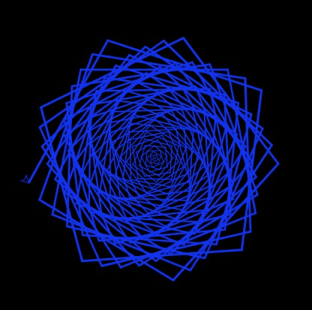

In this activity, we will be creating a "Rainbow Spiral" with the Python
programming language and using the Turtle Library.

We will create a program that will draw lines of increasing width around
a central point making an attractive pattern.

**Taken and adpated from:**
[Geeks for Geeks: Turtle Programming in Python - no4. Rainbow Benzene](https://www.geeksforgeeks.org/turtle-programming-python/)

## 1 - Setup
Go to trinkiet.io and start a new Python project: <http://bit.ly/pythontrinket> (log into your account if you have one or create one to save your progress). Then:

Import the **turtle** module into your project
```python
import turtle 
```

Initialize `Turtle()` as `t`:
```python
t = turtle.Turtle()
```

Initialize `Screen()` as `s`:
```python
s = turtle.Screen()
```

Set the screen background colour to black:
```python
s.bgcolor('black')
```

Set turtle speed to fastest:
```python
t.speed('fastest')
```

## 2 - The for loop

Write a [for loop](https://www.scaler.com/topics/python/for-loop-in-python/) for a range of 200:
```python
for x in range(200):
```

Inside the loop (remember it needs to be indented!) set the pen colour:
```python
t.pencolor('blue')
```

Still inside the loop set the line width to get wider each loop:
```python
t.width(x/100 + 1)
```

Still inside the loop move the turtle forward to draw a line:
```python
t.forward(x)
```

Finally, still in the loop, lets change the angle of the turtle to create the spiral:
```python
t.left(79)
```

## 3 - Run the program!
You should be able to now run the program. You should get something that looks like this:


## 4 - Challenges
-   Can you change the spiral to be a twisty hexagon? (hint: you'll need
    to change the angle)

-   Can you make each stripe in the spiral to be a different colour?
    (hint: you'll need to make a list of colours and select from that
    list)

-   Can you make the spiral reverse itself and do it continuously?
    (hint: you'll need to copy the for loop and reverse something. To
    make it do it continuously you'll have to put both for loops inside
    a while loop)

## 5 - Challenge Solutions
-   Twisty hexagon spiral change line 10 to:
```python
t.left(59)
```
-   Different colours for each stripe
    -   After line 3 insert the following line:
        ```python
        colors = ['red', 'purple', 'blue', 'green', 'orange', 'yellow']
        ``` 
    -   On what is now line 8 select from those colours by dividing the
        current x by 6 and selecting the index with the remainder:
        ```python
        t.pencolor(colors[x%6])
        ``` 
-   Reversing, continuous spiral -- on line 7 replace the for loop with
    the following:
    ```python
    while True:
  for x in range(200): 
    t.pencolor(colors[x%len(colors)]) 
    t.width(x/100 + 1)
    t.forward(x) 
    t.left(59)
  t.right(239)  
  for x in range(200, 0, -1): 
    t.pencolor('black') 
    t.width(x/100 + 7)
    t.forward(x) 
    t.right(59) 
    ```
### Full solution with challenges on trinket:
<iframe src="https://trinket.io/embed/python/8ba1df25ff" width="100%" height="600" frameborder="0" marginwidth="0" marginheight="0" allowfullscreen></iframe>
