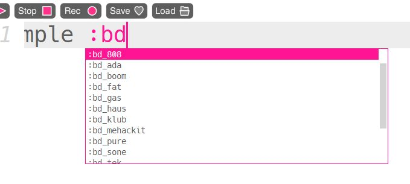

In this activity, we will create a simple electronic music track using the Sonic Pi programming environment.


## 1. Setup

If you are using a Raspian-based computer (PC or Raspberry Pi), you should already have Sonic Pi installed on the computer.

If you need to download Sonic Pi, go to <https://sonic-pi.net/> and choose the correct version to download.  

## 2. First Sounds

Sonic Pi is a programming language designed to play electronic music.  It runs within an _Integrated Development Environment_ that lets you type code and run it with a few key presses.  

When you open Sonic Pi, you should see something like this:
.  

You will write your code on the left.  You can run and stop your code using the menu buttons, or by using key shortcuts (`Alt-R` to run, `Alt-S` to stop).

To test this out, we'll play a drum sample.  Write the following code and run it:

```ruby
 sample :bd_haus
```

When you run this code, you should hear a bass drum sound.  It will only play once, so if you want to hear it again, you will need to run the program again.

Try some different drum sounds.  If you start typing `sample :bd` then you should see an autocomplete menu with some other examples. 

Try changing the sample and run the program again.

## 3. Loops

The most interesting part of Sonic Pi is the ability to create live loops that will keep playing until they are stopped.  Delete the code you have, and replace it with the following:

```ruby
use_bpm 60

live_loop :kick do
  sample :bd_haus, rate: 1
  sleep 0.5
end
```
We set the `bpm` (beats per minute) to 60, which means we get one beat every second.  We then create a loop called `kick` that plays our sample.  It then sleeps for half a beat, which means we get two kick drum samples played per second.

Try changing the `rate` and `sleep` values to see what happens. 

## 4. Drum beat

A typical drum beat has a kick drum, snare drum and hi-hat cymbal.  We'll add these in.  Change your kick drum loop so it looks the same as in the previous section, then add the following code for the snare and hi-hat:

```ruby 
live_loop :snare do
  sleep 0.5
  sample :sn_dolf
  sleep 0.5
end

live_loop :hihat do
  sample :drum_cymbal_closed
  sleep 0.25
end
```

## 5. Bass

So far we have just played samples of drums and cymbals.  Now we will add in an electronic instrument called a _Synthesizer_ to make a nice bass sound.  We will only make it play one note.  Add the following code to your current program:

```ruby
live_loop :bass do
  use_synth :prophet
  play :E1, release: 3
  sleep 2
end
```

Our instrument is an emulation of a famous synthesizer called the _Prophet-5_.  We make it play an `E1` note.  We then sleep for two beats.  Try changing the `release` value to see what happens.

## 6. Arpeggios

This isn't a very interesting song so far, so we'll add in some more synthesizer sounds that are playing random _beep_ sounds.  To make things more interesting, we'll play random notes from a music scale (`E minor`).  

Add the following code to your program:

```ruby
live_loop :bleep do
  use_random_seed 123
  4.times do |i|
    16.times do
      use_synth :beep
      play chord(:E3, :minor).choose, attack: 0, release: 0.1, cutoff: rrand_i(50, 90) + i * 10
      sleep 0.125
    end
  end
end
```

Try changing the `random_seed` number and see what happens.

## 7. Chords

To finish our program, we'll play some chords from the same _E minor_ scale that we used earlier.  Add the following code to your program:

```ruby
live_loop :chords do
  use_synth :blade
  [1, 3, 6, 4].each do |d|
    (range -2, 2).each do |i|
      play_chord (chord_degree d, :e, :minor, 3, invert: i)
      sleep 2
    end
  end
end
```

This code is quite complicated, but it:

* Uses the `blade` synth sound
* Plays through the 1st, 3rd, 6th and 4th chords in the E minor scale in turn (Em, G, C, Am)
* For each chord, it plays four different _inversions_, moving up in pitch with each one.

## Challenges

* Try changing each sample or synth sound
* Try changing the `attack`, `release` or other values of each sound
* Try adding effects (FX) to the sounds.  You can click the _Help_ menu button to see how to do this, and many other capabilities of Sonic Pi.
* Try live coding an entire song!  As an example, you could watch the creator of Sonic Pi here: <https://youtu.be/G1m0aX9Lpts>


## Full code listing

```ruby
use_bpm 60

live_loop :kick do
  sample :bd_haus, rate: 1
  sleep 0.5
end

live_loop :snare do
  sleep 0.5
  sample :sn_dolf
  sleep 0.5
end

live_loop :hihat do
  sample :drum_cymbal_closed
  sleep 0.25
end

live_loop :bass do
  use_synth :prophet
  play :E1, release: 3
  sleep 2
end

live_loop :bleep do
  use_random_seed 123
  4.times do |i|
    16.times do
      use_synth :beep
      play chord(:E3, :minor).choose, attack: 0, release: 0.1, cutoff: rrand_i(50, 90) + i * 10
      sleep 0.125
    end
  end
end

live_loop :chords do
  use_synth :blade
  [1, 3, 6, 4].each do |d|
    (range -2, 2).each do |i|
      play_chord (chord_degree d, :e, :minor, 3, invert: i)
      sleep 2
    end
  end
end
```
